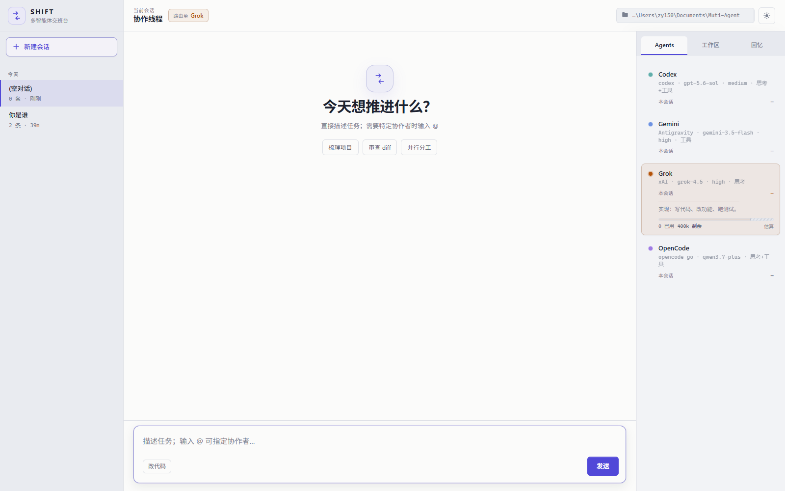

<div align="center">

# SHIFT · 交班台

### 把散落在终端里的 AI Agent，组织成一支会接力的本地团队。

在一个浏览器窗口里调度 **Codex、Gemini、Grok 与 OpenCode**：  
从讨论方案到实现代码，再到审查结果，让不同 Agent 在同一条协作线程中完成交接。


[快速开始](#快速开始) · [Agent 团队](#agent-团队) · [工作方式](#工作方式) · [配置](#配置)

</div>



---

## 这是什么

SHIFT 不是四个聊天窗口的拼盘。它把本机已有的 CLI Agent 接进同一套工作流：讨论、实现、审查可以接力，上下文与交接记录留在本地。

| 你带来的                  | SHIFT 帮你推进到                  |
| ------------------------- | --------------------------------- |
| 还不清晰的想法            | Codex 梳理，Gemini 发散，再收敛   |
| 需要落地的需求            | Grok 在隔离 worktree 中实现       |
| 等待把关的改动            | OpenCode 检查 diff、风险与质量    |
| 跨多轮的复杂任务          | 会话、交接与可检索记忆持续保留    |

**你会看到：** 会话与实时消息、谁在处理、上下文用量、工作区 diff、回忆检索。  
**你会怎么用：** 消息里 `@Codex` / `@Gemini` / `@Grok` / `@OpenCode` 指定协作者；Agent 也可以点名下一位。  
**改代码时：** 默认偏讨论、只读；开启「改代码」后为会话创建或复用 git worktree，先看 diff 再决定如何合入。

---

## Agent 团队

|      | Agent        | 最适合                 | 运行方式          |
| :--: | ------------ | ---------------------- | ----------------- |
|  🟢   | **Codex**    | 澄清问题、推理与权衡   | Codex CLI         |
|  🔵   | **Gemini**   | 头脑风暴、扩展与交叉验证 | Antigravity CLI |
|  🟠   | **Grok**     | 写代码、实现与跑测试   | Grok Build CLI    |
|  🟣   | **OpenCode** | 审查、风险与质量把关   | OpenCode CLI      |

> SHIFT 只做协作与界面，不打包模型或 CLI。按需安装并登录你要用的工具即可。

---

## 工作方式

```text
你提出目标
    →  Codex / Gemini 讨论与收敛
    →  Grok 在隔离 worktree 中实现
    →  OpenCode 审查与把关
    →  你查看过程与结果
```

这不是固定流水线：可以只找一位 Agent，也可以随时用 `@` 换人接手。

---

## 快速开始

**要求：** Node.js 20+，以及至少一个已安装并可用的 Agent CLI。

```bash
git clone <repo-url>
cd SHIFT
npm ci
npm start
```

浏览器打开 [http://127.0.0.1:8787](http://127.0.0.1:8787)，选择项目目录，直接描述任务。

示例指令：

```text
帮我梳理这个项目，找出最值得优先改进的三件事。
@Gemini 为这个功能提出三种方向，再让 @Codex 收敛。
@Grok 实现这个需求，完成后交给 @OpenCode 审查。
```

---

## 本地优先

- 界面与 Node 服务都在本机，默认监听 `127.0.0.1:8787`
- Agent 以本机子进程启动，沿用各自 CLI 的登录与配置
- 会话、transcript、SQLite 记忆写在 **`data/runtime/`**（已 gitignore）
- 「改代码」走会话级 worktree；讨论模式默认不写主工作区

---

## 配置

开箱可用。需要代理、隔离 Codex 缓存、换端口时，复制 [`.env.example`](.env.example) 为 `.env` 后编辑：

```bash
# macOS / Linux / Git Bash
cp .env.example .env

# Windows PowerShell
Copy-Item .env.example .env
```

常见项（详见 `.env.example`）：

| 变量                 | 用途                                      |
| -------------------- | ----------------------------------------- |
| `INVOKE_CLI_PROXY`   | 全员 CLI 共用 HTTP(S) 代理                |
| `INVOKE_CODEX_HOME`  | Codex CLI 状态目录（与桌面版隔离）        |
| `XAI_API_KEY`        | Grok 无头认证（也可用 `grok login`）      |
| `PORT`               | 监听端口（默认 `8787`）                   |

`npm start` 会自动加载项目根目录的 `.env` / `.env.local`。已在 shell 或 CI 里设置的变量优先。

---

## 开发命令

| 命令                   | 用途           |
| ---------------------- | -------------- |
| `npm start`            | 启动控制台     |
| `npm test`             | 运行测试       |
| `npm run check`        | 语法检查       |
| `npm run lint`         | ESLint         |
| `npm run format:check` | 格式检查       |

<details>
<summary><strong>技术轮廓</strong></summary>

```text
Browser UI ── HTTP / SSE ──► Node.js service ── spawn ──► Local Agent CLIs
                                  │
                                  ├── data/runtime (sessions / transcript / SQLite)
                                  ├── skills / identities / handoff
                                  └── git worktree (optional)
```

前端为原生 HTML / CSS / JavaScript；服务端 Node.js，SSE 推送实时事件，`better-sqlite3` 承载本地记忆。

</details>

---

<div align="center">

**SHIFT** — 让 Agent 不只回答问题，也学会把工作交给下一位。

Private · v0.1.0

</div>
